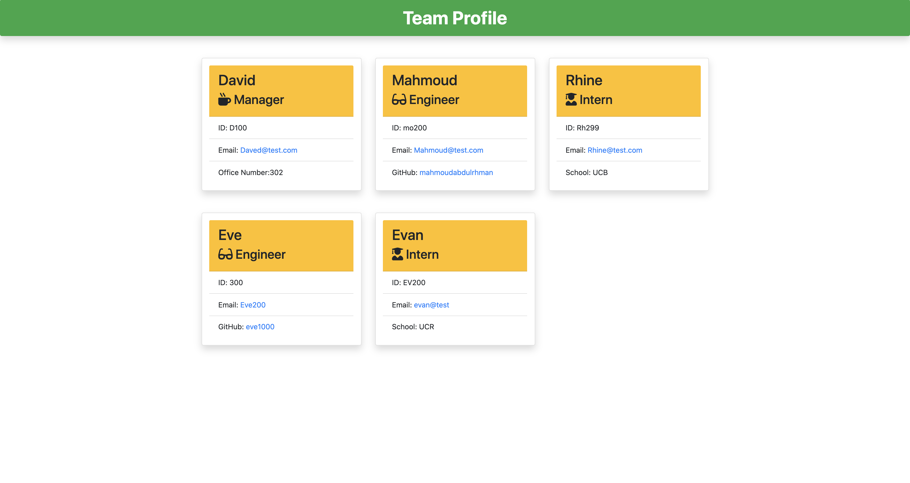

# team-profile-generator

Team Profile Generator
This Team Profile Generator is a Node.js command-line application that gathers your team member's information via questionnaire style. Once questions are answered, a table will show the team member's information and a confirmation message that the Team Profile Generator has been generated and completed. An HTML file will appear in the (distribution) folder and will be available for review and deployment.

## Step By Step Installation

In order to get to the generator questionnaire, you must first download the repository 'team-profile-generator' by clicking the GitHub link under the 'Link to Repository' section. Once the repository is cloned,after that install dependencies be typing npm install in the commend line ,then initiate the command 'node index.js.' A series of questions will be presented to you. After completing the questionnaire, a message showing the table of the team members will show up as a confirmation that the readme file has been created. The generated HTML will be located in the distribution folder (dist) as an 'index.html' file. Open your team's profile is generated, right-click 'index.html' and choose 'Open in Default Browser" and voila!

## Licenses

```${blackBlink.name}
MIT
```

## Test command

```${blackBlink.name}
npm test
```

## Installation

```${blackBlink.name}
npm i
```

## languages

```${blackBlink.name}
JAvaScript,ES6,node.js
```

## Screencastify

[](https://youtu.be/o-oflxz55DM "Team Profile Generator")

<https://drive.google.com/file/d/1ob6g_fjY8XxvYGdIZAxM7VYQpcVfF-7J/view>

## Screenshot


